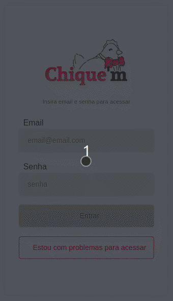
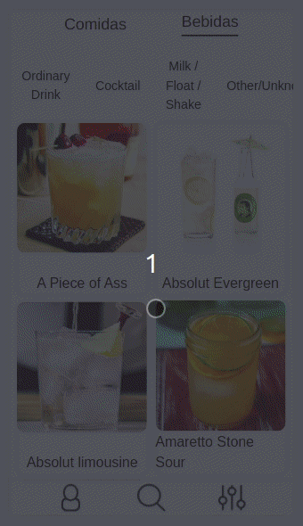
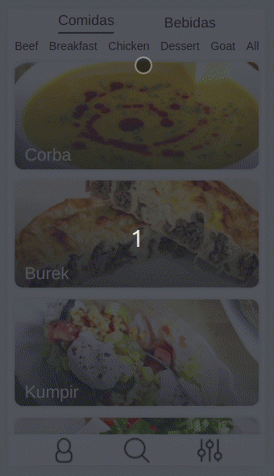

# App de Receitas 🍔🍷

</img>
</img>
</img>
 
 

## Objetivo

O objetivo do projeto é elaborar um App no qual o usuário possa acessar a receita da comida ou do drink selecionado. Tendo também as funcionalidades de compartilhar e de favoritar as receitas, podendo acompanhar o progresso e marcar os passos realizados.

---

 

## Equipe Desenvolvedora

- Diogo Fiuza
- Leandro Xavier
- Marcos Felippe
- Thomas Ferreira
- Vinícius Silva

---

## Tecnológias utilizadas

- React.js
- Redux Toolkit
- Javascript
- CSS
- Jest

---

## Observações

O projeto ainda possui pequenos ajustes de funcionalidades e de estilização a serem realizados.

